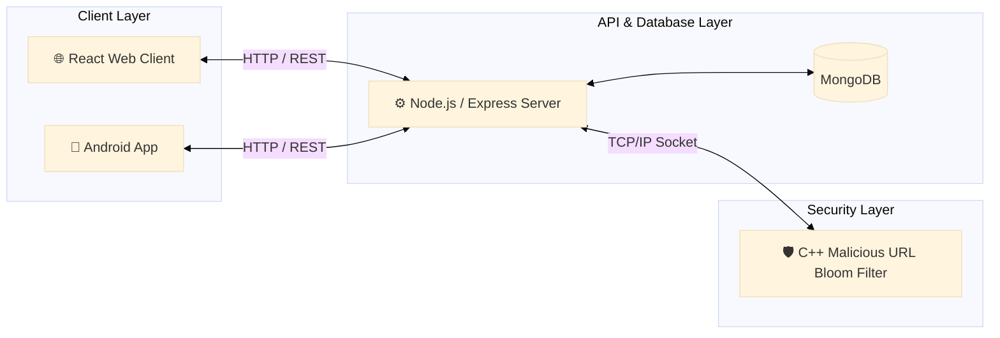

# Maya Rosen
### Software Engineer | Systems Developer | AI Enthusiast

*“I’m a developer who’s always learning, building, and improving — driven by curiosity and a love for turning new ideas into working software.”*

[🔗 Connect on LinkedIn](https://linkedin.com/in/maya-rosen1)

---

### 🛠 Tech Stack

| Category | Technologies |
| :--- | :--- |
| **Languages** | Python, C++, C, Java, JavaScript, Bash |
| **Systems & AI** | PyTorch, NumPy, POSIX, TCP/IP, OpenCV |
| **Full-Stack** | Node.js, React, MongoDB, PostgreSQL,  HTML/CSS |

---

## 🚀 Featured Projects

### 📱 Distributed Social Network & Security Filter
Built a full-stack distributed social network with a React web client, Android app, and Node.js/Express backend, including a custom multithreaded C++ TCP security server that uses a Bloom Filter with multiple hash functions to detect malicious URLs with ultra-low latency.

*   **Tech:** React, Node.js, Java (Android native), C++, TCP/IP Networking, Cybersecurity (URL Filtering)
*   **Links:** [Web Client](https://github.com/MayaRosen/facebook-like-web) | [Android Application](https://github.com/MayaRosen/facebook-like-android) | [Backend](https://github.com/MayaRosen/facebook-like-server) | [Bloom Filter](https://github.com/MayaRosen/facebook-like-bloomfilter)
*   **System Architecture:**

---

### 🧠 3D Geospatial Embeddings
Engineered a high-performance Python data pipeline using spatial mathematics to transform raw latitude and longitude coordinates into continuous 3D Cartesian vectors mapped to a spherical surface, optimizing the feature space for downstream algorithm consumption.

*   **Impact:** Optimized high-dimensional feature space for downstream ML models.
*   **Tech:** Python, NumPy, Pandas, Scikit-Learn, Spatial Mathematics
*   **Repo:** [Geospatial Embeddings](https://github.com/MayaRosen/geospatial-embeddings)

  

---

### 🤖 Autonomous Robot Navigation
A hardware-software integration project featuring a robotics controller that follows physical movement. The system utilizes Ultra-Wideband (UWB) sensors for spatial state management alongside computer vision scripts for real-time object detection and trajectory execution. 

*   **Impact:** Achieved autonomous side-by-side navigation.
*   **Tech:** Python, Computer Vision (OpenCV), UWB Hardware, Robotics
*   **Repo:** [Robot Tracking System](https://github.com/MayaRosen/robot-tracking-system/wiki)

  

---

### 🎮 Markov's Maze: Reinforcement Learning Controller
An intelligent MDP-based controller that uses value iteration and probabilistic planning to solve stochastic puzzles. I integrated a custom BFS deadlock-detection algorithm to ensure optimal, error-free pathfinding

*   **Tech:** Python, Pygame, NumPy, MDP Math Models
*   **Repo:** [Markov's Maze](https://github.com/MayaRosen/markov-maze.git)

  

---

### ♟️ BashBoard & PGN Engine
A dual-interface chess engine built from the ground up. I wrote a Python engine to parse complex Portable Game Notation (PGN) files into Universal Chess Interface (UCI) coordinates. The frontend features a hardcore interactive Unix terminal GUI built entirely in Bash, as well as a modern CSS-Grid web implementation.

*   **Tech:** Bash, Python (python-chess), HTML/CSS
*   **Repo:** [Bash Board](https://github.com/MayaRosen/bash-board.git)

  

---

### 🧠 Machine Learning From Scratch
Projects focused on implementing core ML models from first principles before scaling into modern frameworks.

* **Neural Networks from Scratch:** Built Logistic Regression, MLPs, and CNNs from raw math in `NumPy` before scaling them into modern `PyTorch` architectures.
    * **Links:** [Neural Networks](https://github.com/MayaRosen/ml-exercise-neural-networks) | [Logistic Regression](https://github.com/MayaRosen/logistic-regression-from-scratch)

---

### ⚙️ Systems Programming in C & Assembly
Low-level projects focused on memory, processes, Linux/POSIX APIs, and x86-64 assembly.

* **POSIX C Kernel Operations:** Custom C implementations of Linux system-call workflows, including `fork()` process management, manual inter-process concurrency locking with `O_EXCL`, and a custom I/O memory buffer.
    * **Links:** [Systems IO Toolkit](https://github.com/MayaRosen/systems-IO-toolkit)

* **Assembly Pstring Toolkit:** Implemented Pascal-style string operations in `x86-64 Assembly` and `C`, including length calculation, case swapping, substring copying, menu dispatch, and input validation.
    * **Links:** [Pstrings](https://github.com/MayaRosen/pstrings)
